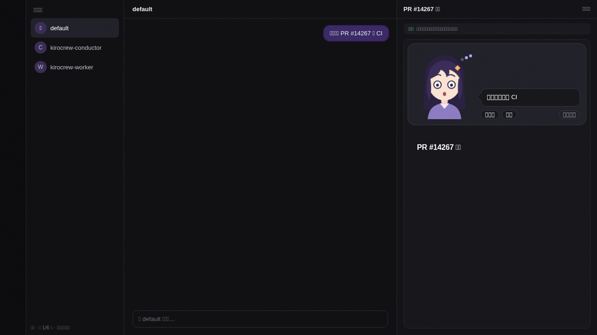
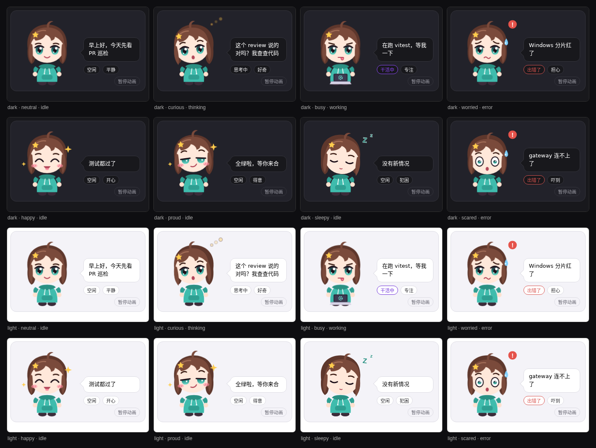

# Xiaoya for Kiro Crew

A Kiro Crew app that puts a small companion, Xiaoya, in each crew's webview on the Crew page. While a crew works, she shows what it is doing and how it feels about it.



No change to Kiro Crew core. The app uses two things Kiro Crew already has:

| Part | What it does | Built on |
|---|---|---|
| `xiaoya/hooks.py` | Installs `xiaoya.html` into the operator template dir on enable, swaps in a plain fallback on shutdown | App Kit `on_startup` / `on_shutdown` hooks |
| `xiaoya/templates/xiaoya.html` | The character plus the generic data view | Crew Webview templates |
| `xiaoya/templates/fallback.html` | The generic data view alone, used while the app is off | Crew Webview templates |
| `xiaoya/skills/xiaoya-react` | Tells a crew when to publish and what to send | App skills |

The hook never overwrites or deletes an `xiaoya.html` it did not write (ownership marker on line 1).

## Install

```bash
kirocrew app install ./xiaoya
kirocrew config set agent.apps_trusted '["xiaoya"]'
kirocrew app enable xiaoya
```

Trusting the app lets its Python hooks run inside the gateway process. Order matters: install first, then trust. A grant set before a local install is refused ("execution trust predates repository binding"). If you must set it first, also add the name to `agent.apps_trusted_local`.

### Who sees the skill

The `xiaoya-react` skill reaches the default `kirocrew` agent. A custom agent template (for example a crew member's) does not see it unless its agent JSON maps it in `resources`:

```json
"resources": ["skill://~/.kiro/crew/skills/xiaoya-react/SKILL.md"]
```

Without that entry, the crew can still publish with `template: "xiaoya"`; it just is not told to. Details: [docs/verification.md](docs/verification.md).

Undo: `kirocrew app disable xiaoya` then `kirocrew app uninstall xiaoya`.

### Disable and uninstall

| Action | `xiaoya.html` becomes | Published panels |
|---|---|---|
| enable, gateway start | full template | show Xiaoya |
| disable, gateway stop, uninstall | fallback | show their data plainly, no character |

The file is never deleted: Kiro Crew renders a panel from its template id on every read, so a missing file breaks every panel already published with it. App Kit's `setup.onUninstall` runs sandboxed and cannot write the template dir anyway. The fallback is inert markup. To delete it too, check its first line is `<!-- installed-by-app: xiaoya -->`, then `rm ~/.kiro/crew/panel-templates/xiaoya.html`; after that, those old panels show a render error until the crew publishes again.

## Publishing

A crew calls `panel_publish`:

```json
{"template": "xiaoya", "title": "PR #123", "data": {
  "xiaoya": {"state": "working", "mood": "busy", "line": "在跑测试"},
  "waiting_on_you": ["合并 PR #123"]
}}
```

- `state`: `idle` · `thinking` · `working` · `error`
- `mood`: `neutral` · `happy` · `curious` · `busy` · `sleepy` · `scared` · `worried` · `proud`
- `line`: one short sentence. Rendered with `textContent`, never as markup.



## Development

The template is rebuilt from Kiro Crew's own `default.html`, so you need a Kiro Crew checkout:

```bash
python3 dev/build.py /path/to/KiroCrew/src     # rewrite xiaoya/templates/*.html
python3 dev/build.py --check /path/to/KiroCrew/src  # exit 1 if they are out of date
python3 dev/gallery.py /path/to/KiroCrew/src   # dev/out/gallery.html, every mood
python3 dev/demo.py /path/to/KiroCrew/src      # dev/out/demo/step-*.html, a scripted run
```

Run the tests (the compose and build tests need a Kiro Crew checkout and skip without it):

```bash
KIROCREW_SRC=/path/to/KiroCrew/src python -m pytest tests -q
```

CI runs the tests against Kiro Crew `main` on every PR. The `--check` drift job runs weekly and on PRs that touch the template sources, so a change to Kiro Crew's `default.html` shows up without blocking unrelated PRs.

Edit the character in `dev/stage.fragment.html` (SVG + CSS) and `dev/stage.script.html` (mood logic).

The panel CSP allows only `data:` / `blob:` images and no media, so the character is inline SVG. Motion stops under reduced-motion and has a pause button.

Design notes: [docs/design.md](docs/design.md).

## Notes

- The character is an original placeholder, not the "赛博小雅" from the Bilibili videos. That design belongs to its author.
- `xiaoya/templates/xiaoya.html` and `fallback.html` contain Kiro Crew's `default.html` template, used under the Apache License 2.0 ([kirodotdev/KiroCrew](https://github.com/kirodotdev/KiroCrew)). This repo is Apache-2.0 too: see [LICENSE](LICENSE) and [NOTICE](NOTICE).
