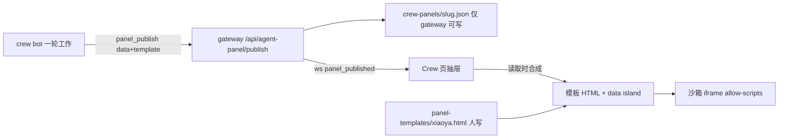
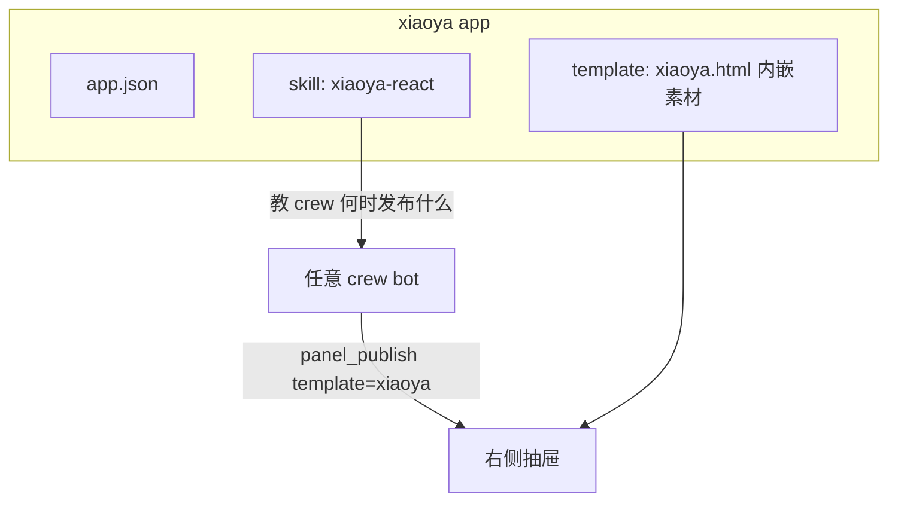

# 赛博小雅 × Crew：设计方案

基于 KiroCrew `origin/main` @ `7b2da39c53`（2026-09-27）阅读结果。

## 1. 结论

你的第 1 点已经存在：Crew 页右侧抽屉里的 **Crew Webview**（`src/kiro_crew/agent_panel.py`）。模板是人写的 HTML，crew 只通过 MCP 工具 `panel_publish` 发布 JSON 数据，默认开启（`agent.crew_panel = true`）。

所以小雅不需要新的面板系统。她 = 一个模板 + 一个 skill + 一套形象素材。Mochi 可借的是"心情模型"和"形象包"，不是它的桌宠窗口。

## 2. 现有机制（已读代码确认）



- 模板查找顺序：`~/.kiro/crew/panel-templates/<id>.html`（运维覆盖，agent 不可写）优先，其次包内 `src/kiro_crew/agent_panel_templates/`。
- crew 名字的 slug 等于模板 id 时自动匹配；也可在 `panel_publish` 里显式传 `template`。
- 合成发生在读取时：改模板不用重新发布。
- 数据上限 64 KB；模板大小不受记录上限约束。
- 每次发布整体替换，不做合并。

## 3. 从 Mochi 借什么

| Mochi 部件 | 文件 | 借法 |
|---|---|---|
| 心情集合 | `mochi/pet_state_manager.py` `ALL_MOODS` | 直接沿用：neutral / happy / sleepy / curious / busy / scared，加 proud / worried |
| 短暂 vs 持续心情 | 同上 `TRANSIENT_MOODS`、`MOOD_DURATION_MS=3000` | 放到模板 JS 里：happy 播 3 秒回 neutral，busy 一直保持 |
| 行为状态机 | `mochi/pet_state_machine.py` | 只取 idle / thinking / working / error 四态，丢掉 walking / offline |
| 形象包 | `mochi/appearance_store.py`、`petdex_import.py` | 借"一套心情一张图"的包结构 |
| 素材脱敏 | `mochi/redact.py` | 不需要：模板用 `textContent` 渲染台词，gateway 发布前已做 `_scrub` |
| MCP 收权 | `mochi/agent_policy.py` | 不需要：小雅不带自己的 agent |

不借：Electron 窗口、专属 `mochi` chat slot、owner loop、watchlist、自己的调度器。小雅寄生在现有 crew 身上，不是独立的 bot。

## 4. 小雅 app 组成



数据约定（crew 发布的 `data`）：

```json
{
  "xiaoya": {
    "state": "working",
    "mood": "curious",
    "line": "这个测试红了，我看看是不是 main 的问题"
  },
  "waiting_on_you": ["PR #123 需要你批"],
  "stats": { "workers": 3, "stuck": 1 }
}
```

- `xiaoya` 块驱动形象：`state` 选姿态，`mood` 选表情，`line` 是气泡台词。
- 其余字段交给模板下半部分，复用 `default.html` 的通用渲染。这样 conductor 这类 crew 原有的状态面板不会被小雅挤掉。

skill `xiaoya-react` 的要点：

- 开始一件事 → `thinking`；动手调工具 → `working`；遇到红 → `worried`；完成 → `happy`；等人批 → `curious` 加一句台词。
- 只在状态真的变了才发布，不要每个工具调用都发。
- 台词一句，12 字以内。

## 5. 代码里发现的限制

| 限制 | 出处 | 影响 | 对策 |
|---|---|---|---|
| CSP 只允许 `img-src data: blob:`，没有 `media-src` | `website/src/lib/widgetSrcdoc.ts` | 不能放视频，不能加载外部图片 | 素材做成 base64 内嵌的动图 WebP / 序列帧 |
| 每次发布都重载 iframe | `CrewWebview.tsx` + `useWebSocket.ts` `panel_published` | 表情切换会闪一下，动画从头播 | P0 接受；P2 改为 postMessage 推数据不重载 |
| 一个 crew 只有一个面板 | `agent_panel.publish` 整体替换 | 小雅和原面板抢位置 | 模板上半小雅、下半通用数据 |
| 表情只在 bot 主动调工具时变 | `mcp_panel.py` | 花 tool call，反应慢一拍 | P2 由 gateway 把回合事件直接喂给面板 |
| App Kit 不能提供面板模板 | `apps/manifest.py` 只有 hooks/routes | app 装上后模板进不了 `panel-templates/` | P1 加 manifest 字段 `panelTemplates` |
| App Kit 没有聊天事件钩子 | `apps/lifecycle.py` 只有 startup/shutdown | app 拿不到 tool_call / 回合结束 | P2 的 core 改动 |

## 6. 分阶段

| 阶段 | 做什么 | 要改 core 吗 | 见效 |
|---|---|---|---|
| P0 原型 | 手写 `~/.kiro/crew/panel-templates/xiaoya.html`，给一个 crew 的 briefing 加发布规则 | 否 | 1 天 |
| P1 做成 app | app 的 `on_startup` 钩子把模板放进 `panel-templates/`，`on_shutdown` 删掉；app 带 skill | 否（已实现，见 `xiaoya/hooks.py`） | 已完成 |
| P2 零 token 反应 | gateway 把 tool_call / approval / turn_done 映射成 state，用 postMessage 推进 iframe，不重载；bot 只负责 mood 和台词 | 是，中 | 1–2 周 |
| P3 更细交互 | 点她、语音、TTS、口型 | 是，大 | 以后 |

P0 能在当天判断值不值得继续：看小雅的反应是否让你更快发现"需要我"的事。

## 7. 风险

- 版权：赛博小雅的形象属于 B 站原作者。要用自己画的或有授权的素材，不能直接截原视频。
- 安全：P1 让 app 往模板目录放 HTML，打破了"模板都是人审过的"这个前提。只允许内置 / 官方 app 提供模板，并在安装时像 app 代码一样审查。台词永远走 `textContent`，不走 `innerHTML`。
- 打扰：小雅是装饰。发布频率要节制，不然每一轮都多一次工具调用。

## 8. 相关资料

- [赛博小雅 · 全技术栈调查](https://0opc.com/guides/cyber-xiaoya-stack/)：原作没有公开"语义 → 表情"的衔接层，正是 crew bot 能补上的部分。
- [JiarenLu666/cyber-girl](https://github.com/JiarenLu666/cyber-girl)：整合仓库，形象层用 LiveTalking，太重，不适合放进抽屉。
